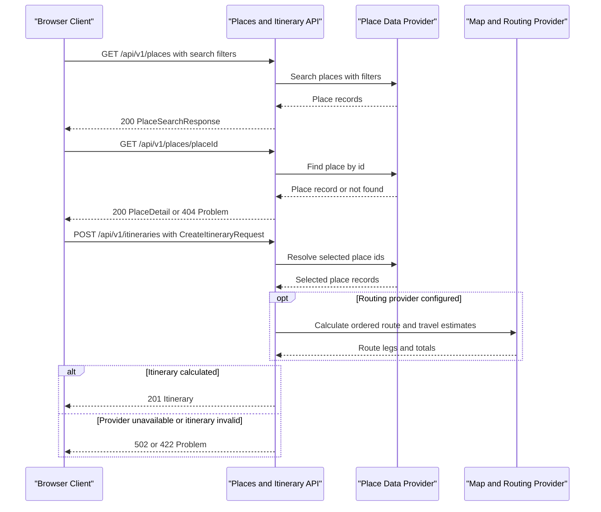

# API & Service Communication Contracts

The frontend uses the Google Maps JavaScript API and Places API (New) for nearby search, place details, photos, and maps; itinerary operations remain local mock functions. This document distinguishes those direct browser integrations from the proposed, versioned application REST contract, which remains a backend integration target rather than a deployed API.

## Service Catalog

| Service | Port | Category | Purpose |
|---|---:|---|---|
| React frontend | 5173 (Vite development server) | Client | Search places, view details, choose destinations, and display itineraries. |
| Google Maps Platform | 443 (HTTPS) | Infrastructure | Places API (New) supplies nearby places/details and Google Maps JavaScript API renders results and maps. |
| Places and itinerary API | TBD | API Layer | Proposed HTTP API replacing the mock operations in `frontend/src/services/api.ts`. |
| Place data provider | Google Places API (New) | Infrastructure | Implemented browser-side nearby/text search and place detail retrieval. |
| Map and routing provider | Google Maps JavaScript API | Infrastructure | Implemented Maps display; road routing and travel estimates remain unimplemented. |

The API is proposed as one independently deployable service for the MVP. No backend modules, deployment manifests, or backend framework have been found in the repository.

## API Endpoints Inventory

All paths below are proposed and prefixed with `/api/v1`. JSON fields use `camelCase`; distances are kilometers and durations are minutes.

| Service | Method | Path | Request Type | Response Type |
|---|---|---|---|---|
| React frontend to Google Places API (New, implemented) | JavaScript SDK | `Place.searchNearby`, `Place.searchByText`, `Place.fetchFields` | Center/radius or text query, explicit requested fields, and Google Maps Platform API key | Google `Place` objects normalized client-side to `Place[]`; at most 20 search results |
| Places and itinerary API | GET | `/api/v1/places` | Query: `q`, `district`, `priceRange`, `maxDistanceKm`, `sortBy`, `originLat`, `originLng`, `page`, `pageSize` | `PlaceSearchResponse` (`items: PlaceSummary[]`, `page`, `pageSize`, `totalItems`) |
| Places and itinerary API | GET | `/api/v1/places/{placeId}` | Path: `placeId` | `PlaceDetail` |
| Places and itinerary API | POST | `/api/v1/itineraries` | Body: `CreateItineraryRequest` | `Itinerary` |
| Places and itinerary API | GET | `/health` | None | Health status; proposed operational endpoint |

### Search behavior

- Query parameters are optional. `sortBy` accepts `distance`, `rating`, or `price`; `priceRange` accepts `budget`, `mid`, `premium`, or `very-expensive`.
- `maxDistanceKm` is a non-negative number. Distance filtering and distance sorting require both `originLat` and `originLng`; if no origin is supplied, the API omits distance-based filtering and returns `distanceKm: null`.
- The frontend obtains an optional origin through the browser Geolocation API after an explicit user action and sends `originLat` and `originLng` to a real API. Until a location is available, the UI must not claim the mock catalog's static `distanceKm` values are user-relative; distance filtering and distance sorting are disabled.
- `district` is an exact district name. `q` searches place names, categories, and tags.
- Pagination defaults to `page=1` and `pageSize=20`; maximum `pageSize` is 100. Search results are returned in a stable order for equal sort values.
- Use `sortBy=distance` only when an origin is supplied; otherwise the API returns `400` with a problem response rather than silently sorting by a different field.

### Create itinerary behavior

`CreateItineraryRequest` has the following shape:

```json
{
  "placeIds": ["banh-mi-26", "sushi-zone"],
  "availableHours": 6,
  "tripType": "foodie",
  "origin": {
    "latitude": 10.7727,
    "longitude": 106.6995
  },
  "travelMode": "walking"
}
```

`origin` and `travelMode` are optional. `tripType` accepts `foodie`, `cultural`, `relax`, or `family`; `travelMode` accepts `walking`, `driving`, or `transit`. The API preserves the caller's selected place set, computes an ordered stop list and route totals, and returns `422` if the requested places cannot form a valid itinerary. `availableHours` is a planning constraint, not the estimated travel duration.

## Management & Observability Endpoints

| Service | Endpoint | Custom Metrics (if any) |
|---|---|---|
| Places and itinerary API (proposed) | `GET /health` | None identified; no metrics endpoint is currently implemented. |

No management, metrics, or health endpoint exists in the current frontend-only repository. `/health` is a suggested backend liveness endpoint; readiness and metrics endpoints should be added only when the backend runtime and deployment needs are chosen.

## DTOs & Contracts

The frontend currently uses `Place`, `SearchFilters`, and `ItineraryResult` in `frontend/src/types.ts`; these are client-side types for mock services, not wire-format DTOs. The following names and roles are proposed for the HTTP contract:

| DTO | API role | Immutability |
|---|---|---|
| `PlaceSummary` | Search list item and compact itinerary stop | Not established; backend implementation should use immutable response models where supported. |
| `PlaceDetail` | Place detail response; includes all summary information plus address and opening hours | Not established; backend implementation should use immutable response models where supported. |
| `PlaceSearchResponse` | Paginated search response envelope | Not established; backend implementation should use immutable response models where supported. |
| `CreateItineraryRequest` | Itinerary creation request body | Not established; backend implementation should treat the request as immutable after parsing. |
| `Itinerary` | Itinerary creation response | Not established; backend implementation should use immutable response models where supported. |
| `ItineraryStop` | Ordered stop item with sequence, place summary, and per-leg estimate | Not established; backend implementation should use immutable response models where supported. |
| `Problem` | Standard API error response using the RFC 7807 problem-details shape | Not established; backend implementation should use immutable response models where supported. |

`PlaceSummary` should carry a nullable `distanceKm`: the current mock data contains fixed distances, but the frontend does not yet collect a user's location. `ItineraryStop` should expose `sequence`, `arrivalOffsetMinutes`, `legDistanceKm`, and `legDurationMinutes`; `Itinerary` should expose `totalDistanceKm`, `totalDurationMinutes`, and ordered `stops`. Keep location coordinates numeric and define their order explicitly as latitude then longitude in JSON.

No gateway aggregation DTOs, OpenAPI/Swagger specification, protobuf schema, GraphQL schema, or server serialization configuration is present. JSON is the proposed media format (`application/json`); errors use `application/problem+json`.

## Communication Patterns

- **Current frontend behavior:** React pages call local mock itinerary functions. Search and details use Google Places API (New) through the Google Maps JavaScript SDK; Google Maps renders place markers and routes. Google Maps attribution remains visible, Places cards are visually separated from the map, and photo-author attributions are displayed when supplied. There are no calls to an application backend, backend services, queues, or other application inter-service calls in the repository.
- **User location:** On first entry in a browser session, the frontend displays an app-level consent dialog. If the user chooses to allow location, the browser's Geolocation API requests native permission and obtains coordinates; declining dismisses the dialog for the session. Coordinates are kept in session storage and are sent to Google Places only when the user has allowed location and nearby results are searched. Location is not reverse-geocoded into a street address. The browser API is not a backend HTTP endpoint and does not require an API key.
- **Google Maps Platform usage:** Nearby/text search and detail requests are user-driven; searches are debounced and capped at 20 results. No Places content is cached or persisted; only place IDs are used in detail URLs. The browser key is configured through `VITE_GOOGLE_MAPS_API_KEY` and must be restricted by HTTP referrer and allowed APIs. Billing is usage/SKU-based and must be enabled in Google Cloud; returned price level is relative, not an exact menu price. The app has no automatic retry/fallback when Google returns an error.
- **Proposed API communication:** The browser calls the Places and itinerary API synchronously over HTTPS in production. The API owns search, detail retrieval, and itinerary composition. If external place or route providers are adopted, the API calls them server-to-server and maps their responses into the public DTOs.
- **Gateway and composition:** No API gateway is present. The proposed single API service returns composed `Itinerary` responses, including stop order and route estimates; the browser should not merge responses from multiple providers.
- **Resilience:** No retry, timeout, circuit-breaker, or fallback policy is implemented. Proposed defaults: use bounded connect/read timeouts for provider calls; retry only transient failures of idempotent GET requests with a small capped backoff; do not blindly retry itinerary POST requests. If persistent creation is introduced, support an idempotency key before allowing POST retries. Provider failure should return a clear `502`/`503` problem response; the frontend may then offer retry and retain its selected places.
- **Discovery and load balancing:** No service discovery or client-side load balancing exists. The frontend should use a configured API base URL; internal provider endpoints should be configurable by the backend deployment rather than embedded in client code.
- **Authentication and transport:** No authentication, authorization, or backend TLS configuration is implemented. The current app has no user accounts. For production, serve the API over HTTPS; add authentication only if user-specific saved itineraries or other protected data are introduced.
- **Persistence:** Itinerary “save” is currently only an in-memory UI toggle. There is no save/list/delete itinerary API and no persistence contract. Add those endpoints only when account or cross-session persistence requirements are agreed.
- **Versioning and errors:** URL versioning uses `/api/v1`. Errors use RFC 7807 fields (`type`, `title`, `status`, `detail`, and optional `instance`/`errors`). Expected statuses include `400` malformed query/body, `404` unknown place, `422` valid request that cannot produce an itinerary, `429` rate limited, and `502`/`503` provider or service unavailable.

## Service Technology Matrix

| Service | Web | Data Access | Discovery | Gateway | Actuator | Cache | Metrics |
|---|---|---|---|---|---|---|---|
| React frontend | React + Vite | Google Places API (New) and local itinerary mock | None | None | Google Maps JavaScript API | No Places content cache | None |
| Places and itinerary API (proposed) | TBD | TBD | None identified | None identified | Proposed `/health` | TBD | TBD |

## Service Communication Sequence

<!-- mermaid-checked: every participant uses `participant Id as "Label"`, no \n in aliases/messages/notes, every alt/opt/loop closed by end, no `:` inside any alias -->

